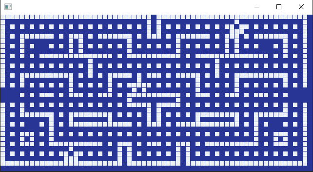
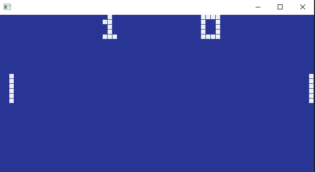
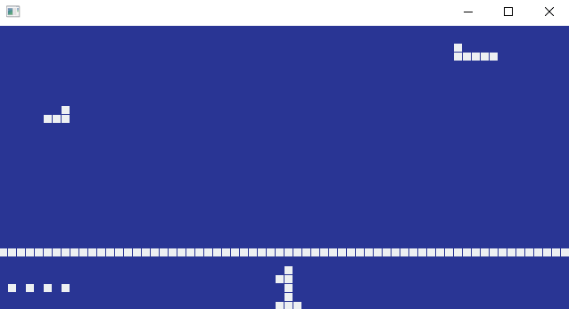

# chip-8

A chip 8 emulator made in rust and piston

# How to

You must have [rust](https://www.rust-lang.org/es-ES/install.html) installed. Then in shell run:

```
cargo run
```

# Screenshots

Blinky



Pong



Airplane


